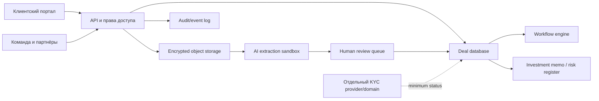

# Цифровая операционная модель агентства

## Принцип

Это не SaaS-компания, которая заодно продаёт недвижимость. Это high-trust advisory/service business, у которого software делает работу проверяемой, повторяемой и удобной. Клиент видит меньше хаоса, а команда получает один источник истины.

## Клиентский путь

| Этап | Клиент получает | Automation/AI | Обязательный human gate |
|---|---|---|---|
| 1. Qualification | ясность fit/no-fit и следующий шаг | structured intake, meeting summary, preliminary completeness | основательница подтверждает fit и scope |
| 2. KYC/readiness | безопасный checklist и статус | reminders, completeness, vendor workflow | compliance review/escalation |
| 3. Thesis | buy box, exclusions, capital plan | scenario drafting, comparable framework | клиент утверждает assumptions; adviser signs memo |
| 4. Search | comparable longlist/shortlist | ingestion, dedupe, matching, freshness alerts | deal lead подтверждает каждый client-facing claim |
| 5. Screen | independent deal memo | document extraction, missing-data detection, scenario calculations | finance/property reviewers approve their sections |
| 6. LOI/arras | decision pack и negotiation issues | version compare, deadline/task extraction | lawyer/lead approves legal/negotiation outputs |
| 7. Due diligence | risk register и Q&A | classification, cross-document inconsistencies | named specialists own conclusions |
| 8. Closing | timeline, costs, approvals | reminders, status, summary | client/notary/lawyer sign; no autonomous submission |
| 9. 100 days | launch plan and owner baseline | KPI pack, vendor reminders | operator/owner approves actions |

## Основные сущности данных

- `party` — человек/организация, роль, representation;
- `mandate` — scope, сторона, территория, срок, fee, конфликт;
- `buy_box` — капитал, leverage, asset, geography, role, exclusions;
- `asset` — property и operating-business identifiers;
- `claim` — утверждение, источник, автор, дата, confidence, reviewer;
- `document` — owner, version, access class, retention;
- `metric` — period, definition, source, normalized/raw flag;
- `scenario` — assumptions, outputs, author, approved version;
- `risk` — category, probability, impact, owner, resolution;
- `task` — responsible professional, due date, dependency;
- `decision` — question, alternatives, evidence, approver, timestamp;
- `fee/conflict` — payer, beneficiary, disclosure, client consent;
- `KYC case` — отдельный restricted domain, не общий deal workspace.

## Архитектура доверия

KYC-контур возвращает в deal system только нужный статус и ограниченный набор метаданных. Паспортные/source-of-funds документы не попадают в общий AI search.

## Agentic workflows

### A1. Intake analyst

Преобразует анкету/встречу в draft buy box, показывает противоречия и пропуски. Не квалифицирует капитал и не обещает fit автоматически.

### A2. Document intake agent

Классифицирует документы, извлекает поля с page-level citations, обнаруживает дубликаты/версии. Любое critical field требует reviewer.

### A3. Data quality agent

Сравнивает seller claims с P&L, licences, registry/technical inputs; создаёт questions, но не обвинения и не legal conclusions.

### A4. Memo copilot

Собирает draft из утверждённых claims/scenarios. Неподтверждённое маркирует; не создаёт цифры без source.

### A5. Translation copilot

Делает summary, сохраняя ссылку на оригинал и пометку non-certified. Юридически значимый перевод передаётся квалифицированному переводчику.

### A6. Deal coordinator

Предлагает next actions, meeting agendas, reminders и weekly brief. Внешняя отправка — через approval.

### A7. Seller readiness agent

Сопоставляет data room со стандартом asset type и строит gap list/readiness score. Score объясним, не является valuation.

### A8. Owner reporting agent — позже

Формирует narrative по утверждённым KPI и anomalies. Не управляет ценами, персоналом или платежами.

## Уровни автономии

- **Green:** поиск внутри разрешённых документов, внутренний draft, dedupe, reminders — автоматично с логом.
- **Yellow:** client-facing summary, translated text, risk suggestion, external email draft — обязательный human approval.
- **Red:** legal/tax conclusion, KYC decision, movement of funds, e-sign, submission to authority, contractual change, publication of ROI — AI не исполняет автономно.

## Build vs buy

### Купить/использовать managed

Auth/MFA, encrypted object storage, e-sign, KYC/AML screening, email/calendar, CRM basics, backups, monitoring. Здесь собственная разработка почти не создаёт конкурентного преимущества и увеличивает риск.

### Построить

Deal data model, claim/source graph, buy-box logic, camping/hospitality schemas, memo builder, decision/risk views, партнёрский workflow и клиентский layer поверх managed components.

### Не строить в первый год

Mass marketplace, mobile app, autonomous legal bot, proprietary valuation model, pan-European data platform, full property-management system, consumer insurance marketplace.

## Метрики цифрового слоя

- доля client-facing claims со source/reviewer: 100% critical, >90% all;
- время от data receipt до first memo: <5 business days;
- повторный ввод одного поля: <10%;
- weekly active portal use среди активных mandates: >70%;
- вопросы «какой статус?» в мессенджере: −30% после второго кейса;
- critical AI error, дошедший до клиента: 0;
- median partner response SLA и overdue tasks;
- time spent per memo и доля gross margin.

